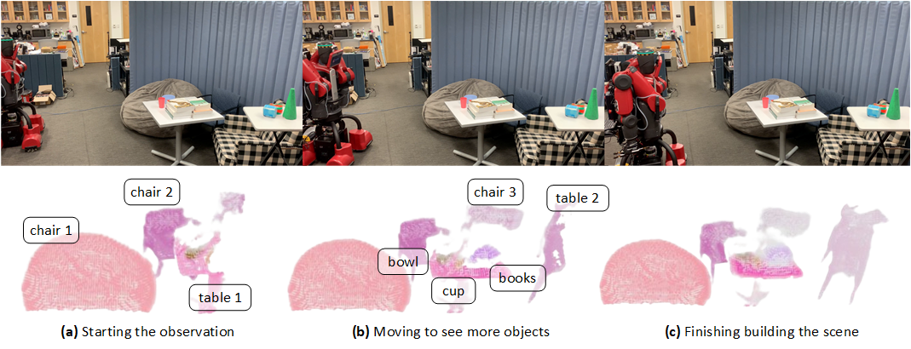

<!-- PAPER TITLE -->

# Volumetric Mapping with Panoptic Refinement using Kernel Density Estimation for Mobile Robots

<!-- TABLE OF CONTENTS -->

<details>
  <summary>Table of Contents</summary>
  <ol>
    <li><a href="#authors">Authors</a></li>
    <li><a href="#abstract">Abstract</a></li>
    <li><a href="#prerequisites">Prerequisites</a></li>
    <li><a href="#method-overview">Method Overview</a></li>
    <li><a href="#segmentation-refinement-via-depth-perception">Segmentation Refinement via Depth Perception</a></li>
    <li><a href="#experiments-on-flat-dataset">Experiments on Flat Dataset</a></li>
    <li><a href="#deployment-on-baxter-robot">Deployment on Baxter Robot</a></li>
    <li><a href="#citing">Citing</a></li>
  </ol>
</details>

## Authors

<ol>
    <li><a href="https://mkhangg.com/">Khang Nguyen</a></li>
    <li><a href="https://www.tuandang.info/">Tuan Dang</a></li>
    <li><a href="https://www.uta.edu/academics/faculty/profile?username=huber">Manfred Huber</a></li>
</ol>

>  All authors are with Learning and Adaptive Robotics Laboratory, Department of Computer Science and Engineering, University of Texas at Arlington, Arlington, TX 76013, USA.

<!-- ABSTRACT -->

## Abstract

Reconstructing three-dimensional (3D) scenes with semantic understanding is vital in many robotic applications. Robots need to identify which objects, along with their positions and shapes, to manipulate them precisely with given tasks. Mobile robots, especially, usually use lightweight networks to segment objects on RGB images and then localize them via depth maps; however, they often encounter out-of-distribution scenarios where masks over-cover the objects. In this paper, we address the problem of panoptic segmentation quality in 3D scene reconstruction by refining segmentation errors using non-parametric statistical methods. To enhance mask precision, we map the predicted masks into a depth frame to estimate their distribution via kernel densities. The outliers in depth perception are then rejected without the need for additional parameters in an adaptive manner to out-of-distribution scenarios, followed by 3D reconstruction using projective signed distance functions (SDFs). We validate our method on a synthetic dataset, which shows improvements in both quantitative and qualitative results for panoptic mapping. Through real-world testing, the results furthermore show our method's capability to be deployed on a real-robot system. The demo is available at [YouTube](https://youtu.be/u214kCms27M).

<p align="center">
   <br/>
</p>

<!-- PREREQUISITES -->

## Prerequisites

* [KDEpy](https://github.com/tommyod/KDEpy) (version 1.1.5)
* [panoptic-mapping-ros](https://github.com/ethz-asl/panoptic_mapping/tree/main/panoptic_mapping_ros) (ROS package)
* [pyrealsense2](https://github.com/IntelRealSense/librealsense) (version 2.51.1.4348)
* [Open3D](https://github.com/isl-org/Open3D) (version 0.16.0)

A bit of modification for `KDEpy` library can be found at [KDEpy_mod](./KDEpy_mod/). Please replace the [bw_selection.py](KDEpy_mod/bw_selection.py) file with the original one.

<!-- METHOD OVERVIEW -->

## Method Overview

Indoor mobile robots operating in an environment with multiple objects refines RGB-based segmentation masks using kernel density estimation via depth perception and rebuilds panoptic map with object instances using projective signed distance functions.

<p align="center">
   <br/>
   <i>Refined Panoptic Mapping when Robot Moving in an Indoor Envinronment.</i>
 </p>

<!-- SEGMENTATION REFINMENT VIA DEPTH PERCEPTION -->

## Segmentation Refinement via Depth Perception

### Methodology 

Depth maps of object instances containing depth outliers (*top row*) due to the imperfection of segmentation models and their density estimations along depth perception (*middle row*), and refined depth maps (*bottom row*). The shaded depth values on the density lines in between vertical red cutoff lines are considered inliers; otherwise, rejects as they appear to be outliers.

<p align="center">
   <br/>
   <i>Segmentation Mask Refinement Process.</i>
 </p>

### Capture, Segment, and Refine 

To capture a scene with segmentation (point clouds of instances), run [semantic_scene_perception/capture_segment_scene.py](semantic_scene_perception/capture_segment_scene.py) file:

```
python semantic_scene_perception/capture_segment_scene.py
```

The resultant point cloud (and their respective colored/depth images) is saved in `semantic_scene_perception/cap_data/exp[NO]`. A notification line is notified in the terminal.

To produce the removal process, run [refined_panoptic_mapping/remove_depth_outliers.py](refined_panoptic_mapping/remove_depth_outliers.py) file:

```
python refined_panoptic_mapping/remove_depth_outliers.py
```

The plots illustrating cutoffs is displayed followed by side-by-side view of noised and cleaner point clouds.

<p align="center">
   <br/>
   <i>Outlier Removal on Point Clouds of Instances.</i>
 </p>

## Experiments on Flat Dataset

### Qualitative Results on Flat Dataset

Qualitative results on the *flat* dataset of **(a)** the original panoptic mapping approach, **(b)** the original approach coupled with mask refinement, **(c)** our approach without mask refinement, and **(d)** our approach with mask refinement. The room texture and its panoptic segmentation ground truth are retrieved based on RGB images and annotation masks provided by [the original approach's framework](https://github.com/ethz-asl/panoptic_mapping). Note that the robot frame indicating its pose is simplified and represented as the RGB mesh frame in each reconstructed map.

<p align="center">
   <br/>
   <i>Qualitative Results on Flat Dataset.</i>
 </p>

### Dataset

The *flat* dataset can be downloaded from the original [ASL Datasets](https://projects.asl.ethz.ch/datasets/doku.php?id=panoptic_mapping).

Refer to the [panoptic_mapping/flat_dataset/run1/download.txt](panoptic_mapping/flat_dataset/run1/download.txt) file to download the dataset. Remember to change the `path` to your desired destination.

```
export FLAT_DATA_DIR="you/path/to/flat/dataset"
```

Once downloaded, copy the `run1` folder and rename to `run1_mod_2`, `run1_mod_4`, `run1_mod_5` and replace the predicted `.png` images from the respective folders to proceed with building the maps.

### Run Maps

To build **(a) original panoptic** map, use contents of the following files:

- `mapper/flat_detectron_org.yaml`
- `launch/run_org.launch`

To build **(b) original panoptic with refinement** map, use contents of the following files:

- `mapper/flat_detectron_org_with_refinement.yaml`
- `launch/run_org_with_refinement.launch`

To build **(c) our approach without refinement** map, use contents of the following files:

- `mapper/flat_detectron_without_refinement.yaml`
- `launch/run_without_refinement.launch`

To build **(d) our approach with refinement** map, use contents of the following files:

- `mapper/flat_detectron_with_refinement.yaml`
- `launch/run_with_refinement.launch`

To build **(e) room texture** map, use contents of the following files:

- `mapper/flat_detectron_room_texture.yaml`
- `launch/run_room_texture.launch`

To build **(f) panoptic ground truth** map, use contents of the following files:

- `mapper/flat_detectron_panoptic_ground_truth.yaml`
- `launch/run_panoptic_ground_truth.launch`
- also change `flat_data_player.py (line 105)` to `pred_file = file_id + "_segmentation.png` to allow ROS reads and publishes the ground truth segmentation.


## Deployment on Baxter Robot

We mount the Intel RealSense D435i RGB-D camera on the display of the Baxter robot. The Baxter robot moves in an indoor environment to observe the objects in the scene while performing volumetric rendering and perception outlier rejection. 

<p align="center">
   <br/>
   <i>Deployment on Baxter Robot and Reconstructed Panoptic Mapping Result.</i>
 </p>

 To run the demo with an Intel RealSense D435i RGB-D camera, run [refined_panoptic_mapping/demo.py](refined_panoptic_mapping/demo.py) file:

```
python refined_panoptic_mapping/demo.py
```

**NOTE:** If you find this repositpory useful, please also give the [GitHub repository](https://github.com/ethz-asl/panoptic_mapping) of `panoptic-mapping` kudos when you use this code for your work! 

## Citing

```

```
